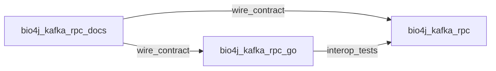

# Go port plan (wire 1.7)

Wire-compatible Go implementation of Kafka RPC for mixed Java/Go infrastructure on a shared Kafka bus.

**Repository**: [bio4j-kafka-rpc-go](https://github.com/tormoz70/bio4j-kafka-rpc-go)  
**Wire spec**: [wire/](../wire/) in this repo  
**Reference implementation**: [bio4j-kafka-rpc](https://github.com/tormoz70/bio4j-kafka-rpc) (Java)

## Architecture



## Stack

| Component | Choice |
|-----------|--------|
| Module path | `github.com/tormoz70/bio4j-kafka-rpc-go` |
| Kafka client | [franz-go](https://github.com/twmb/franz-go) |
| Protobuf | `google.golang.org/protobuf` |
| Codegen | `protoc-gen-kafka-rpc-go` (phase P5) |

## Package layout

```
bio4j-kafka-rpc-go/
  kafkarpc/
    constants.go      # mirror KafkaRpcConstants
    channel.go        # Channel interface
    pooled_channel.go # PooledChannel (producer + reply consumers)
    server.go         # Server dispatch + reply
    stream.go         # StreamSink, StreamingCall
    errors.go
  cmd/protoc-gen-kafka-rpc-go/
  example/            # Greeter interop with Java
```

## Public API (target)

```go
type Channel interface {
    Request(ctx context.Context, method string, req []byte) ([]byte, error)
    Send(ctx context.Context, method string, req []byte) error // oneway
    StartStream(ctx context.Context, method string, req []byte, opts StreamOpts) (StreamingCall, error)
    Close() error
}

type Handler func(ctx context.Context, req []byte) ([]byte, error)
type StreamHandler func(ctx context.Context, req []byte, sink StreamSink) error

type Server interface {
    Register(method string, h Handler)
    RegisterStream(method string, h StreamHandler)
    Start(ctx context.Context) error
    Stop(ctx context.Context) error
}
```

Typed stubs from `.proto` arrive in P5.

## Phases

### P0 — Unary (MVP)

**Scope**

- `kafkarpc/constants.go` — header names and defaults
- `PooledChannel`: producer, reply consumer(s), `group.id` suffix `-inst-{uuid}`, `seekToEnd`, pending map by `correlationId`
- `Server`: consume request topic, dispatch by `kafka-rpc-method`, reply to header topic
- Unknown method → ignore + warn
- Default timeout 30s, max message 10 MiB

**Done when**

- Java `Greeter` server + Go client: `GetGreeting` round-trip
- Go `Greeter` server + Java client: same
- Golden header test: Go-produced record parsed by Java (and reverse)

**Files to add**: `channel.go`, `pooled_channel.go`, `server.go`, `example/greeter/`

### P1 — Oneway

**Scope**

- `Send()` without waiting for reply
- Codegen convention: `returns google.protobuf.Empty` (manual until P5)

**Done when**

- Java oneway handler + Go client `Send()` completes without pending reply
- Go oneway server + Java client stub

### P2 — Ordered server-streaming

**Scope**

- Stream start headers (`kafka-rpc-stream`, idle timeout, ordered)
- `StreamSink.Send` / `End` with `kafka-rpc-stream-end`
- `StreamingCall` with chunk delivery and close
- Record key = `correlationId`

**Done when**

- Ordered stream: Java server → Go client, Go server → Java client
- Error chunk with `kafka-rpc-error`

### P3 — Healthcheck and idle timeout

**Scope**

- Client periodic healthcheck (`{method}/healthcheck`, `kafka-rpc-stream-id`)
- Server `kafka-rpc-stream-not-found`
- Server idle cancel from `kafka-rpc-stream-server-idle-timeout-ms`
- Orphan activity cleanup

**Done when**

- Long-lived stream survives healthchecks
- Dead stream detected via healthcheck timeout
- Server cancels idle stream

### P4 — Scalable streams and backpressure

**Scope**

- Methods prefixed with `Scalable` → `key = null`, `kafka-rpc-stream-ordered=false`
- `maxConcurrentStreams` semaphore on server
- `streamMaxInFlight` backpressure on `Send`

**Done when**

- Scalable stream interop with Java
- `Send` blocks at in-flight limit (test)

### P5 — Codegen

**Scope**

- `protoc-gen-kafka-rpc-go` generating:
  - `SERVICE_NAME`, typed `Client`, `Server` interface
  - Oneway / unary / server-streaming from proto flags
- Mirror Java `KafkaRpcGenerator` naming: `GreeterKafkaRpc`

**Done when**

- Example service builds from `.proto` only (no hand-written method strings)
- Generated API usable in `example/`

## Testing strategy

| Layer | Tests |
|-------|-------|
| Unit | Header encode/decode, dispatch, pending map, stream state |
| Golden wire | Byte-level record fixtures shared Java ↔ Go |
| Integration | Testcontainers Kafka + cross-language Greeter |
| Regression | Scenarios from [interop-checklist.md](interop-checklist.md) |

## Out of scope (this roadmap)

- Client-streaming / bidi-streaming
- Exactly-once semantics
- Topic/ACL/schema registry management
- Spring-style DI / channel pool (Go apps use constructors; optional `fx` helper later)

## Versioning

- Go module tags track wire `VERSION` in docs repo for breaking wire changes
- Non-breaking Go API changes: minor/patch only
- Wire-breaking change: bump `VERSION` in docs, MAJOR in Java and Go

## Current status

| Phase | Status |
|-------|--------|
| P0 | Done — unary channel/server, headers, kfake tests, CI |
| P1 | Done — oneway Send, server contract |
| P2 | Done — ordered StreamSink/StreamingCall |
| P3 | Done — healthcheck, idle timeout, orphan cleanup |
| P4 | Done — Scalable streams, maxConcurrentStreams, in-flight backpressure |
| P5 | Done — `protoc-gen-kafka-rpc-go`, Greeter example |

Update this table as phases complete.
