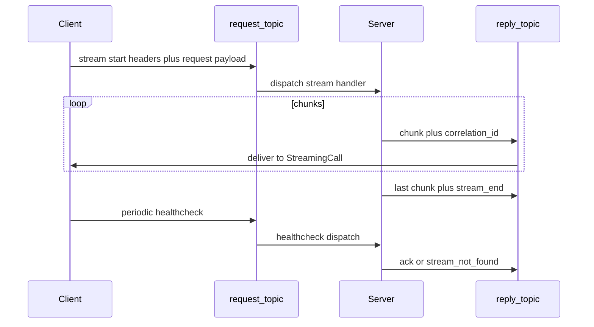

# Server-streaming

## Lifecycle

## Stream start (client)

Required headers:

- `kafka-rpc-stream` = `"true"`
- `kafka-rpc-stream-server-idle-timeout-ms` — server cancels stream if no healthcheck within this window

Optional:

- `kafka-rpc-stream-ordered` — `"true"` (default) or `"false"`
- `kafka-rpc-stream-id` — used by healthcheck

## Ordered vs scalable

| | Ordered | Scalable |
|---|---------|----------|
| Method naming | Any (no `Scalable` prefix) | Method name starts with `Scalable` |
| Kafka record key | `correlationId` | `null` |
| Chunk order | Preserved (single partition per key) | Not guaranteed |
| Use case | Strict ordering | Higher throughput fan-out |

## Stream end

Server sends final chunk with header `kafka-rpc-stream-end` = `"true"`.

`end()` must wait for in-flight chunks (backpressure) before completing — same semantics as Java `StreamSinkImpl`.

## Errors and cancel

- Server may set `kafka-rpc-error` on a chunk (e.g. stream cancelled).
- Client should close `StreamingCall` when consumption stops (`AutoCloseable` in Java).

## Healthcheck

- Interval (client default): 5_000 ms
- Client timeout if no healthcheck response: 15_000 ms
- Method wire name: `{ServiceName}/{MethodName}/healthcheck`
- Header `kafka-rpc-stream-id` identifies the stream

If server no longer has the stream:

- Reply includes `kafka-rpc-stream-not-found` = `"true"`

## Server limits

| Limit | Default |
|-------|---------|
| `maxConcurrentStreams` | 1024 (hard cap via semaphore) |
| `streamMaxInFlight` | 64 chunks per stream before `send` blocks |
| `streamServerIdleTimeoutMs` | From client header (default 20_000 ms if client config omits) |

## Client channel behavior

- Initialize stream activity tracking on `startStream` (avoid orphan idle entries).
- Do not silently overwrite active stream context for the same `correlationId` — reject or cancel old stream.
- `cleanupStaleEntries` must remove orphan activity keys.

## Related

- [rpc-types.md](rpc-types.md)
- [topology.md](topology.md)
